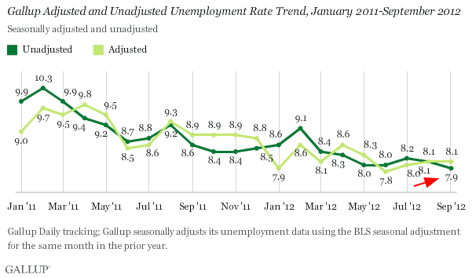

```{r, echo=FALSE}
knitr::opts_chunk$set(echo = TRUE, warning=FALSE)
suppressWarnings(suppressMessages(suppressPackageStartupMessages(library(ggplot2))))
```
# Introduction

This example was developed from an example by Prof. Mine
Çetinkaya-Rundel of Duke University presented in
[this](https://www.youtube.com/watch?v=tKmyzhvgudw) YouTube video.

The problem uses data from a
[September 2012](http://news.gallup.com/poll/157871/unadjusted-unemployment-rate-september.aspx)
Gallup poll of the **unadjusted unemployment rate** of the population.
This survey reported the unemployment rate of the population as
7.9%.



# A simple problem

Prof. Çetinkaya-Rundel first poses the following problem:

> Among a **random sample** of three Americans, what is the probability
> that **only one** is unemployed?

We need to compute the probabilities for 3 **mutually exclusive scenarios**

We begin with the following probabilities: $P(U) = 0.079$ and
$P(E) = 1 - P(U) = 0.921$ where $P(U)$ is the probability that the
person is **unemployed** and $P(E)$ is the probability that the
person is employed. We now compute the probability for three
scenarios:

1. $\frac{0.079}{U} \times \frac{0.921}{E} \times \frac{0.921}{E} = 0.067$
2. $\frac{0.921}{E} \times \frac{0.079}{U} \times \frac{0.921}{E} = 0.067$
3. $\frac{0.921}{E} \times \frac{0.921}{E} \times \frac{0.079}{E} = 0.067$

Note that the **order** does not change the result. We may then sum the
probability from the three permutations to get the probability of
$P = 3*0.067 = 0.201$ or a `20.1%` probability of **selecting three**
**Americans where only one is unemployed.**

# A slightly more complicated problem

Now consider a slightly more complicated problem:

> Among a random sample of **8 Americans**, what is the probability
> that **only two** are unemployed?

This has more permutations...

1. $\frac{0.079}{U} \times \frac{0.079}{U} \times \frac{0.921}{E} \times \frac{0.921}{E} \times \frac{0.921}{E}\times \frac{0.921}{E}\times \frac{0.921}{E}\times \frac{0.921}{E} = 0.079^2 \times 0.921^6 = 0.0038$

2. $\frac{0.079}{U} \times \frac{0.931}{E} \times \frac{0.079}{U} \times \frac{0.921}{E} \times \frac{0.921}{E}\times \frac{0.921}{E}\times \frac{0.921}{E}\times \frac{0.921}{E} = 0.079^2 \times 0.921^6 = 0.0038$

3. $\ldots$

This would take a while by hand. Happily, R has the `choose()` function
that is useful calculating the number of scenarios to organize a given
number of successes (`k`) in a given number of trials (`n`).

$\dbinom{n}{k} = \frac{n!}{k!(n-k)!}$

Recall that our task was to arrange 2 unemployed people in 8 total
people, so $n=8$ and $k=2$. So,

$\dbinom{8}{2} = \frac{8!}{2!(8-2)!} = \frac{8!}{2! \times 6!} = \frac{8 \times 7 \times 6!}{2 \times 1 \times 6!} = 28$

We can also use the R function `choose()`

```{r useChoose}
ans <- choose(8, 2)
ans
```

$P\dbinom{2 \ unemployed}{among \ 8} = number \ of \ scenarios \times probability \ of \ one \ scenario$

or 

$P\dbinom{2 \ unemployed}{among \ 8} = 28 \times (0.079^2 \times 0.921^6) = 28 \times 0.0038 = 0.1064$

there is a `10.64%` chance that we could find 2 unemployed people among
a random sample of 8 people.

It will be interesting to repeat the analysis from data from the
[Bureau of Labor and Statistics](https://data.bls.gov/timeseries/LNU04000000)
when we reach this point in the class each year.


