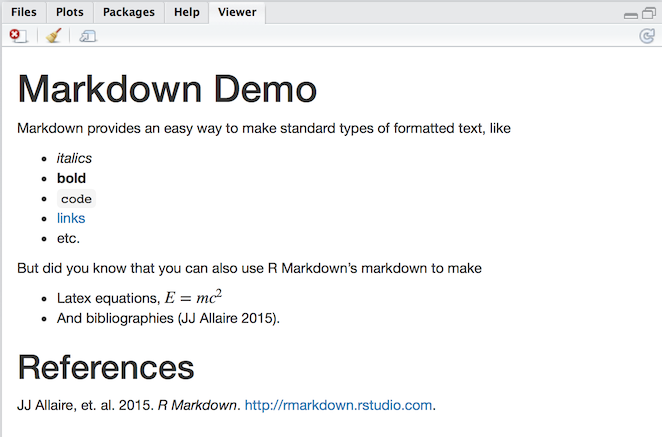

```{r, echo=FALSE}
knitr::opts_chunk$set(echo = TRUE, warning=FALSE)
suppressWarnings(suppressMessages(suppressPackageStartupMessages(library(ggplot2))))
```
# Introduction

R and R-Studio provide a very powerful environment for statistical
analysis and visualization of data. R is a Open Source language
developed by statisticians for statistical analysis and visualization of
a wide range of data. It is both powerful and popular. Like any
software there is a learning curve. Happily, the `#rstats` community
on Twitter is very helpful. Examples are typically a Google search
away. The
[Modern Dive](https://ismayc.github.io/moderndiver-book/2-getting-started.html)
text by Chester Ismay and Albert Y. Kim is a helpful resource. So is
the free [OpenIntro](https://www.openintro.org/stat/textbook.php)
textbook and their
[playlist](https://www.youtube.com/channel/UCPAHrheP8gcpml0tSVhKOWg)
of YouTube videos. They also have the instructions to use
TI calculators. There is also a github repository for the
[OpenIntroLabs](https://github.com/andrewpbray/oiLabs-base-R.git). Most of these were written by Andrew Bray and Mine Çetinkaya-Rundel.

You will enjoy enjoy yourself if you follow this great advice from
[Kim Cressman](https://twitter.com/swmpkim/status/1004555112587710465): 

> Don't feel like you have to **learn R**, like you have to know
> *everything* before you can do *anything*.
>
> Just pick a thing you want to do, and learn how to do it.
>
> It's easier to digest when you have a goal - learn the steps that
> get you there.


## Benefits of using R and RStudio

1. **Cost**: Both are freely available. R is Open Source. RStudio is available
in Open Source and commercial editions. Both programs run on Windows/Mac/Linux
operating systems.

2. Both are **widely used** both in universities and in large and small corporations.

3. The RStudio integrated development environment permits us to write
**reproducible reports** that use a technique called **literate programming**
made popular by Donald Knuth at Stanford University. We embed the
**code chunks** that do our computations **in our reports** (i.e. show our
work).  The code is run when we generate the report and the results are
included in the report. **No more cutting and pasting**!!! This permits our
audience to see our work and run it on their own computers if they wish. This
both **improves communication** and **reduces errors.** We can also include
mathematical equations if needed, such as the formula for a 
**binomial distribution** that we will use in Chapter 5.

$$f(x) = \dbinom{n}{x} \ p^x (1-p)^{(n-x)} \ where \ x=1,2,\ldots,n$$


A simple example is shown below where we compute the mean and standard
deviation of a series of test scores. (We will use the R package `pander` to
make nice looking output). Note the use of **comments** (preceded by `#`) to
explain our work.

```{r computeTestScores}
# we need to tell R that we want to use the pander package for the table
library(pander)
# Our test scores... We create a list.
scores <- c(99, 97, 90, 87, 82, 82, 80, 80, 78, 77, 75, 73, 70,
						68, 65, 62, 60, 55, 45, 40)
# compute the mean and standard deviation
# these are both built-in functions because they are used frequently
avg <- mean(scores)
std <- sd(scores)
# make a list of results and round to 1 decimal place 
ans <- round(c(avg, std), 1)
# add labels for a table
names(ans) <- c("mean", "std dev")
# print the table..
pander(ans)
```

4. Help with Rmarkdown

**Rmarkdown documents** use a simplified markup language to format documents.
This results in **plain text** documents that are easily maintained under
version control. Version control helps us to not lose our work and lets
us recover from moments where we say, "I **really** wish I didn't do
that..."

You can find a good introductions to Rmarkdown
[here](https://rmarkdown.rstudio.com/lesson-1.html). The last item
on the page is a helpful [cheatsheet](http://www.rstudio.com/wp-content/uploads/2016/03/rmarkdown-cheatsheet-2.0.pdf)
that you can download for quick reference. After a bit of practice you will
remember the codes you use most of the time and will need the cheatsheet
less and less.

[This image](https://d33wubrfki0l68.cloudfront.net/873d04e575f5e47dac3c8f91d101c71a28a3d506/6571d/lesson-images/markdown-1-markup.png)
from R-Studio is reproduced below to give you an idea of what it looks like.
I split the view into two pieces so it fit on the page better


Which is then rendered as



You can find help on writing mathematical equations on the
[artofproblemsolving.com](http://artofproblemsolving.com/wiki/index.php/LaTeX:Commands)
website. This site was designed for advanced high school students. You 
can find most of what you may need for statistics on
[equplus.net](http://equplus.net/). They have a
**wide range of examples**.


## Our approach

Many instructors have concluded that the best way to start is by
learning to **understand the objective of our analysis** and our
**data set**. First we will learn how to get our data into R. Often
this will require us to transform a **messy** data set into a **tidy**
format that is easier to analyze and plot.

Next we want to plot our data to look for patterns. Finally, we will
apply the appropriate statistical algorithms to answer the question
that prompted our study. Finally, we will prepare a report that
summarizes our results. We will use **Rmarkdown** to write a report
that embeds our computations to make a report that can be
reproduced by someone else.

## Where to get the software

Our intention is to install the software on the LCS computers. If you
have a computer at home, you can get the software and install it
on your own system. The software runs on Windows, Mac, and Linux. Your
teacher can give you some hints to help you with your system. 

## How to get help

Most of those who answer questions are volunteers. The likelihood of
getting a response increases when you show that you are being
considerate.

1. Do a Google search first.
2. Make your question specific. Explain what you have tried and what
did not work as you expected.
3. Make a **minimum reproducible example** that works with a simple
data set that is easily available. Explain what did not work as
expected.
