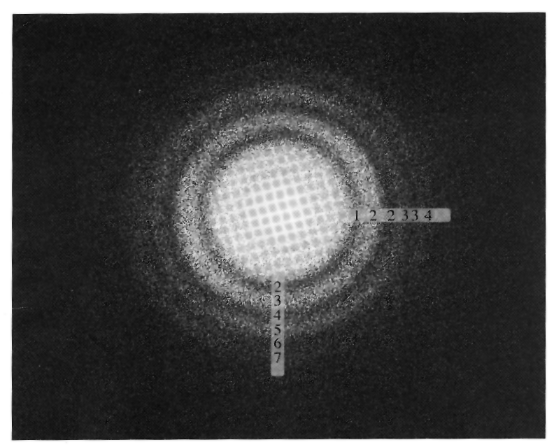

```{r, echo=FALSE}
knitr::opts_chunk$set(echo = TRUE, warning=FALSE)
suppressWarnings(suppressMessages(suppressPackageStartupMessages(library(ggplot2))))
```
# Introduction

Linear regression is a useful technique in many sciences. The example shown here
uses regression analysis to measure the **spherical aberration coefficient**
for a high resolution transmission electron microscope. We will have to do some
pre-processing of the data to get it into a linear form. 

We are analyzing the spacings of maxima and minima in the rings in the image
below.



# Load the data

The measurements are stored in a dataframe. First we set some microscope
parameters and then read in the data.

```{r readData}
library(statshelpR)
library(pander)

kV <- 100. # The microscope was operated at 100 kV
Cs <- 2.0  # The microscope had a spherical aberration coefficient of 2.0 mm

data(olk_data)
pander(olk_data)
```

# Convert the data into a linear form suitable for a linear regression.

Before process the data, we will need a function to compute the
wavelength of the electron beam.

```{r wavelengthFunction}
fWavelength <- function (fVoltk){
	# A function to compute the electron wavelength from the voltage
	result <- 0.387818/sqrt(fVoltk * (1.0 + 0.978459e-3 * fVoltk))
	return(result)
}

```

Now we can process the data in our datafame to make a linear equation. This
is a common practice in chemistry and physics. The details are beyond the scope
of our example. The code below transforms our data into the desired linear
form.

```{r processDataframe}

nr <- nrow(olk_data)
x <- 1:nr
y <- 1:nr
wL <- fWavelength(kV)

for (i in 1:nr){
	nR <- olk_data[i,1]
	mM <- olk_data[i,2]
	uR <- olk_data[i,3]
	v3 <- (wL**3) * 1.0e7
	u2 = uR * uR
	x[i] <- u2
	y[i] <- -(2 * nR-mM)/u2
}

dfFit <- data.frame(x=x, y=y)
pander(dfFit)
```

# Calculate the linear regression

Now we can calculate the linear regression and look at the default output.

```{r doLinearFit}
fit <- lm(y ~ x)

pander(summary(fit))
```

We can compute some other quantities that help us calculate our parameters.
The details are beyond the scope of this example.

```{r otherComp, echo=FALSE}

b <- fit$coefficients[[1]]
a <- fit$coefficients[[2]]
yMin <- min(y)
yMax <- max(y)
yDelta <- yMax - yMin
xMin <- min(x)
xMax <- max(x)
xDelta <- xMax - xMin
trData <- data.frame(X=x,Y=y)
fmeans <- mean(trData)
nL = length(x)

fcov <- (nL-1) * var(trData)

xbar <- fmeans[1]
ybar <- fmeans[2]
SXX <- fcov[1,1]
SXY<- fcov[1,2]
SYY <- fcov[2,2]
betahat1 <- SXY/SXX
# print(round(betahat1,3))
betahat0 <- ybar - betahat1*xbar
# print(round(betahat0,3))
RSS <- SYY - SXY^2/SXX
# print(RSS)
sigmahat2 <- RSS/(nL-2)
# print(sigmahat2)
sigmahat <- sqrt(sigmahat2)
# print(sigmahat)
SSreg <- (SYY -  RSS)
R2 <- SSreg/SYY
k<-1
nTop <- (1-R2)*(nL-1)
nBot <- (nL-k-1)
adj.R2 <- 1-(nTop/nBot)
fEps <- b/(2.0 * wL )
fCs <- a/(wL*wL*wL)

# create CI
xStep <- xDelta / 100
dummy.x <- seq(xMin, xMax, xStep)
conf.frame <- data.frame(x=dummy.x)
fit.conf <- predict(fit, interval="conf", newdata = conf.frame)

```

# Plot the results

Next we plot our results. The medium gray region is the uncertainty
of the position of the line. Notice the results near the ends of the
data are less certain than those in the middle.

```{r plotResults, fig.width=7.25}
plt <-	ggplot(data=dfFit, aes(x=x, y=y)) +
		geom_point() +
		stat_smooth(method='lm',formula=y~x) +
		xlab(expression(u^2)) +
		ylab(expression(-(2 * n[ring] - delta[max])/u^2)) +
		ggtitle("Thon Ring Analysis of Krivanek data") +
		theme(axis.text=element_text(size=12),
		axis.title=element_text(size=12),
		plot.title=element_text(hjust = 0.5)) # center the title

print(plt)

```

# Output the results we need

Finally, we output the key results as a table. The $R^2$ and $adjusted\ R^2$
values are measures of the **goodness of fit**. These should be as close to 1
as possible. This is a **very good fit**.

```{r output}

outLabel <- c("Slope", "Intercept", "defocus [nm]", "Cs [mm]", "R2", "Adj R2")

outVal <- c(sprintf("%.2f", a), sprintf("%.2f", b), sprintf("%.2f nm", fEps/10),
		    sprintf("%.3f mm", fCs/1.0e7), sprintf("%.4f", R2),
		    sprintf("%.4f", adj.R2))

dfOut <- data.frame(Label=outLabel, Value=outVal)

pander(dfOut)


```
